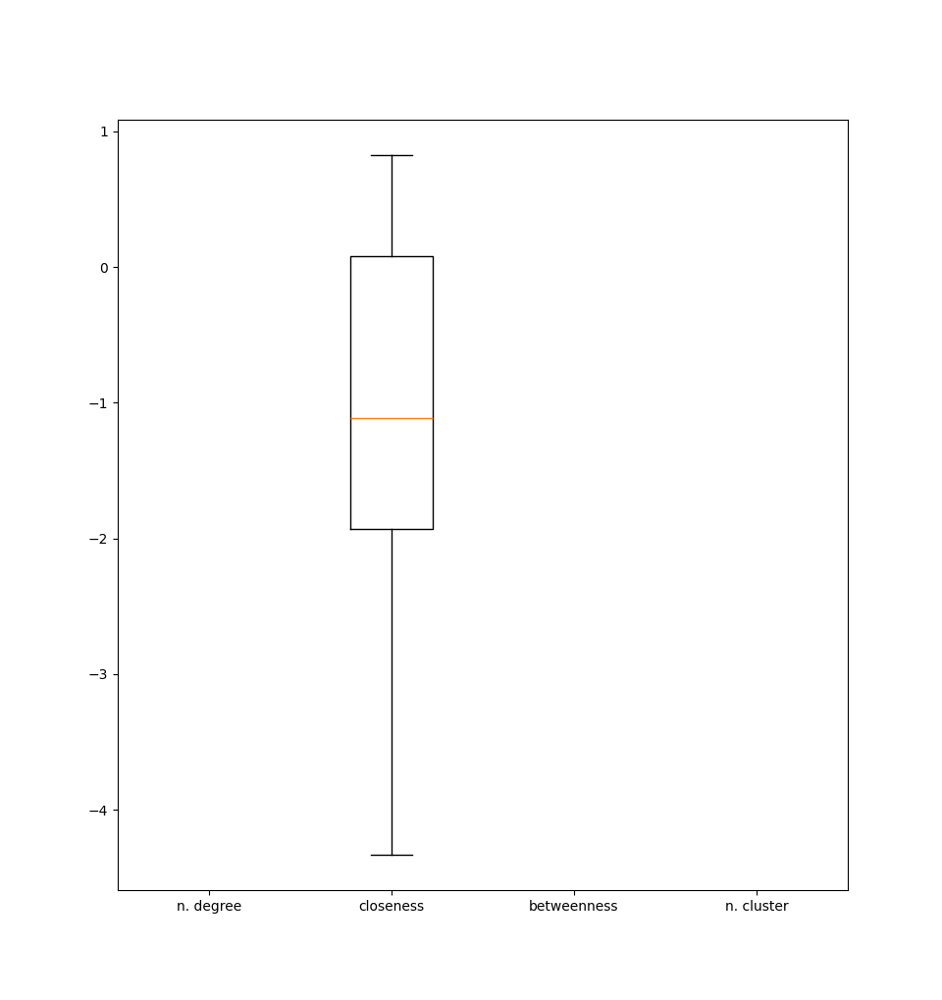

# How well do Simple Graph Convolution and GraphSAGE perform on Dihydrofolate reductase inhibition learning problem?

for the moment work with only `DHFR` dataset, consider modified `DHFR-MD` later

Plan - 1st run :

1. [ ] generate and store random collection by naive method (modded Chung-Lu with MC constraint rejection)
2. [ ] re-compute analytics on the randomly generated network collection. Start with sth simple, e.g. node degree
3. [ ] compute z-scores and p-values on analytic feature to wstablish if they are statistically significant
4. [ ] traditional ML on pure node features. Use sth simple, e.g. MLP with one hidden layer and some dropout
5. [ ] random classifier on external and significant features
6. [ ] compute DeepWalk embeddings (if does not work, use node2vec)
7. [ ] traditional ML on node embeddings, e.g. MLP with one hidden layer and dropout
8. [ ] GraphSAGE with readout layer
9. [ ] SimpleGC with readout layer

Plan - 2nd run:
1.  generate ans store random collection with ONE of the advanced methods available in DIG
2. re-compute node centralities, clustering coefficient
3. re-compute graphlet count
4. compute z-scores and p-values on the new feature and establish if they are statistically significant.
5. redo all the rest starting from the new raw features

# Storing operations on graph collections

Consider the original `DHFR` dataset.

The chose graph representation [@morrisTUDatasetCollectionBenchmark2020] is based on raw text files and is compatible with PyG `DataLoader`, randomly generated collections should follow the same structure. 

+ the collection slides are given as `graph_indicator` where each line is assigned a graph id. This used for splicing `node_attributes` and`node_labels` files where the number of lines correponds to the total number of nodes in the collection. Nodes in a graph are distinguished by loking at the corresponding `graph_indicator` line: this file is **not** used for reading the adjacency matrix.
+ the edges $E$ are given as sparse adjacency matrix, where entries of the whole collection are considered. The result is a big graph where the number of connected components corresponds to the number of graphs in the collection (because here each graph in connected). 
+ `graph_labels` gives the labels of each graph and has a number of lines equal to the number of networks in the collection

**Addition of new features as node attributes**. Each new features can be stored in separate file having a number of lines equal to the total number of nodes in the collection. Different files should then be combined to a new `node_attributes` file when loading the dataset on PyG

Handling graph classification from node features:

+ traditional ML on external and significat features just needs an updated version of the `node_attributes` file.
+ traditional ML on embeddings. Embeddings for each node are ment to replace entirely the `node_attributes`. Computed embeddings can be stored in csv format in a separate file that shall be renamed before the `DataLoader`
+ when using embeddings with the artificial graph-representative, fully-connected node, the embedding resulting at the end of the embedding optimization is taken as representative of the entire graph. #check The problem then become a standard ML task classification where the information  of the original graph structure has been (hopefully) encoded in this node's embedding
+ GraphSAGE and SimpleGC take care of encodings automagically so there is no need to create separate graphs. #check probablynot SGC ...

**Addition of graph-representative nodes**. A new, fully connected, node shall be added to each graph for embeddings testing. The resulting embedding on this artificial node is then to be extracted as representative of the entire graph : ^899c63

1. ASSUME the artificial node is to be appended as last node of the modified graph. The node is added by specifying node attributes and labels, therefore 1 new line is to be written at the end of files  `node_attributes` and `node_labels` with the chosen values.  The `graph_indicator` file needs to be updated accordingly by ading the sequence 1, 2, ... , 756 at the end.
2. Edges can be added by writing the corresponding entries in the adjacency matrix `A` file. Since the artificial node is adjacent to all nodes, for a generic graph $G=\tpl{V,E}$ in the collection, $2n=2\crd{V}$ edges need to be written (graphs are undirected) - for each graph #check is this true ?
3. The creation of this modified collection is done only once, as the only thing that might chage during operations si the embedding of the artificial node.

# Statistically significant features

**Goal**:  compute z-scores and p-values on traditional graph analytics in order to choose which features to be added to the external features before node embedding procedures.

The main problem is considering node labels (identifier of the chemical element): physically only certain bonds between atoms make sense. This falls under the broader topic of *drug discovery*. **One naive method is conpared with a more advanced method found in literature**

## Random graph generation

**Naive generator**. First idea is inspired from the Chung-Lu algorithm and aims at building edge probabilities $p_{u,v}$ that take into account the different node labels and the frequency with which different nodes are directly connected by an edge. Remarks:

+ while (as in Chung-Lu) the set of nodes for eFirst ideaach graph is preserved, the algorithm does not ensure one connected component. This could be solved by rejecting all samples that do not comply with this constraint in MC fashion
+ visually comparing random samples against the original molecule (both pictorial representation and *spy* plot of the adjacency matrix) seem to miss fundamental chemical properties such as the fact that a given atom can have a limited number of chemical bonds
+ The fact that the clustering coefficient (CC) for all nodes in the collection is null [[#^33a60a]] could be used to assess the quality of this naive generator. Computing the corresponding z-scores and p-values for the clustering coefficient of the randomly generated networks *should* say that the CC are not significant features.

Implementation pseudocode for the naive generator. Let $N$ be the desired number of random collections to be generated. the idea is to generate all $N$ random samples of each molecule as it comes, thus generating all $N$ collections in a batch-parallel fashion with [PyG multiprocessing](https://pytorch.org/docs/stable/multiprocessing.html#module-torch.multiprocessing). 
Each random collection should be given a unique identifier and a folder should be created:

+ the `graph_indicator` file never changes as the number of nodes is preserved by the algorithm : the file can be copied form the original one
+ dumping the adjacency matrix should be done in sparse COO fashion
+ the computation of analytical attributed should be delegated to a later moment

~~Second idea was to generate random graph with random walks and precomputed probabilities. ~~

~~Third idea is to implement swapping ~~

**Advanced generator.** The **Dive Intro Graphs** framework [@liuDIGTurnkeyLibrary2021] provides the implementation of several advanced algorithms for graph generation

+  JT-VAE [@jinJunctionTreeVariational2019]
+ **GraphAF** [@shiGraphAFFlowbasedAutoregressive2020] can be trained using `DenseDataLoader` from PyG and one of the available `train_` methods available in `dig.ggraph.method.GraphAF` class. Once the model has been trained, generation of random samples can be done using the method `run_rand_gen` form the same class
+ GraphDF [@luoGraphDFDiscreteFlow2021]
+ GraphEBM [@liuGraphEBMMolecularGraph2021]

## Computed analytics

Consider the original `DHFR` dataset.  ~~How does **all this** change with the modified dataset `DHFR-MD` ~~

Node degree, betweenness centrality, and closeness centrality, values ?

The node clustering coefficient is identically 0 for all molecules. Inspections from pictorial representations of the molecules seem to confirm this result, as no triangle can be seen. ^33a60a

Graphlet count is not straight forward. Inspection of pictorial representations of samples from the dataset suggests to take into account loops having variable length. #done ?
#think What graphlets are we counting ? ideally all those that are statistically significant, and this implies that you have to compute the count on the randomly generated collections

## Significant analytics 

Fill in the table with the computed z-scores and p-values, final column for decision if keeping

|analytics|z-score|p-value|significant|
|--|--|--|--|
| degree |  |  |  |
| betweenness c. |  |  |  |
| closeness c. |  |  |  |
| clust. coeff. |  |  |  |
| graphlet 1 |  |  |  |
| graphlet 2 |  |  |  |
| graphlet 3 |  |  |  |
| graphlet ... |  |  |  |

how can you deal with multiple random collections from the two different random generation methods ? #think maybe it's better to make a *box plot*...

# 0. Random classifier

tossing a coin, many times to get an idea of the average

how is this related to the sample prir distribution of graph labels in the original dataset ? is this distribution preserved by the 
#think is it sound to use the same entropy for both training and validation sets by computing the entropy from the whole dataset ?

# 1. Traditional ML classifier

This approach is not inductive. The model requires a fixed input dimension, but here we are classifying graphs with a variable number of nodes. A way to condense node information is needed :

+ compute the sample mean and/or sample variance of node feature. Possibly stack the two computations one on top of the other. This effectively handles the variability on the number of nodes by introducing a linear combinating function
+ the approach of adding a graph-representative node to each network in the collection is not a clever idea because you will have to compute the values for the new node based on the values of the other nodes' features. This is likely to result in a linear combinating function that is equivalent to the one proprosed above. 

[^vandin231221]: this is actually being confirmed by Prof. Vandin when asked during lections

One-hidden-layer MLP with ReLU activation function and dropout, hyperparameters: 
hidden layer size, drop probability, number of epochs, (optimized hyperparameters)

Logistic regression (linear model) used in GraphSAGE paper

# 2. DeepWalk + traditional

Compute embeddings with PyG, how ? #todo see tutorial by ALonga UNITN, adapt jupyter code from node2vec implementation. There is a `node2vec.py` example in the official PyG repo, can you adapt it to run with deepwalk? #think about using node2vec instead of deepwalk since it's already implemented in PyG
#tfo what's the difference between deepwalk and node2vec ?
#tfo it might be a stupid idea to store the embeddings with a limited precision in a text file, better using `torch.save` to store a binary file. But then, ho do you use the `DataLoader` with precomputed embeddings ?

Potentially a different traditional model could be used on these embeddings as there is no formal guarantee that those working well with raw features work well with embeddings as well.

[DeepWalk](https://docs.dgl.ai/en/latest/generated/dgl.nn.pytorch.DeepWalk.html) layer in Deep Graph Library (DGL). Is this compatible with PyG? sebrerebbe di si perchè in questa libreria c'è il sotto modulo pytorch...

There are two methods for performing classification of entire graphs: either a function combines the information of the different nodes, or an artificial node is added (see lecture notes, p.132):

+ the combination function is usually the sample mean or the sample variance. The mean is more popular but the variance could be stacked after the components of the mean. The overall operation is linear
+ the addition of a new node modifies the graph and can be performed as described above [[#^899c63]]. An initial value for the feature of the artificial node should be provided: this choice depends on the data available on the dataset
+ the `DHFR` node attributes correspond to absolute positions $x_v\in \R^3$ of the atoms $v\in V$ in the molecule $G=\tpl{V,E}$. It seems meeningful to compute the dimensions of the resulting *convex hull* for every graph by considering all positions $X\in\M_{\R}^{\crd{V}\times 3}$ and computing the eig.val.s of $X^T X$ (it's a positive number, so the square does not bother)
+ other analytical features should be deduced combining the information on the original graph's analytical fetures which should be unaffected by the addition of the artificial node. To this end, it is customary to use the sample mean of the original features.

# 3. GraphSAGE

#tfo what's the input? the input should be the external and significant features as this method takes care of the whole pipeline (embedding and predicting model)

there is an example on the official PyG repo: `graph_sage_unsup.py` #todo modify to add graph representation and labels (supervised)

# 4. Simple Graph Convolution

#tfo what's the input ? is this a full fledge pipeline ? maybe not

there is an example on the official PyG repo `sgc.py`
# Model comparison (information scores)

From [@kononenkoInformationbasedEvaluationCriterion1991] the proposed information score (relative) is $$I_r = I_a/E \quad I_a = \frac 1 T \sum_j I(j) \quad I:{\set{1,\dots, k}\atop C}{\to \atop\mapsto}{\R \cap (-\infty, 1]\atop \begin{cases} V_c(C) & P'(C)\geq P(C) \\ V_m(C) & \text{otw} \end{cases}}$$ where:

+ $P(\bullet)$ and $P'(\bullet)$ denote the prior and posterior (the classifier) probabilities for a given class. Usually the prior is estimated from the relative frequencies computed using the training set
+ the value for a correct prediction of class $C$ is $V_c(C)=-\log_2P(C)+ \log_2P'(C)$
+ the value for a misclassified prediction is $V_m(C) = -\log_2[1-P(C)]+ \log_2[1-P'(C)]$
+ $T=\crd{\set{1,\dots, k}}$ is the number of classes to predict
+ the entropy $E = \sum_i P(i) \log_2P(i)$ for all classes $i$, is the object of a fundamental assumption: the entropy in the training and test set are the same.

The comparison of the information score is carried out against the classification *accurancy* (also called *efficiency*) $$\frac{TP+TN}{TP + TN + FP + FN}$$ where $TP$ and $TN$ denote correct predictions(true positives and true negatives, respectively) while FP and FN represent misclassifications (false positives and false negatives, respectly). Note that:

+ that the denominator is simply the number of elements in the testing set (totasl number of predictions).
+ #todo summarize intuition form paper §3.3

The *F1-score* is different in general as it is computed as the harmonic mean of the *precison* $TP \over TP+FP$ and the *recall* $TP \over TP + FN$ thus resulting in: $$F_1 = \frac{2}{\text{precision}^{-1}+\text{recall}^{-1}}= \frac{2 TP}{2 TP + FP + FN}$$
where intuitively #todo summarize intuition from wikipedia page

#tfo difference with Fisher information score [@lyTutorialFisherInformation2017]

Final comparison table should look like the following, recall that all values **should be given** as pair of expected value and sample variance ! #think Instead of a table, you could make a plot ... 

| classifier | input | F1-score | accuracy | I-score|
| -- | -- | -- | -- | -- |
| random | ext. feat.s   significant analytics | $\mu \pm \sigma$  |  |  |
| (traditional) | same |  |  |  |
| (traditional) | DeepWalk embeddings |  |  |  |
| GraphSAGE | ? |  |  |  |
| SGC | ? |  |  |  |

conclusion ...

