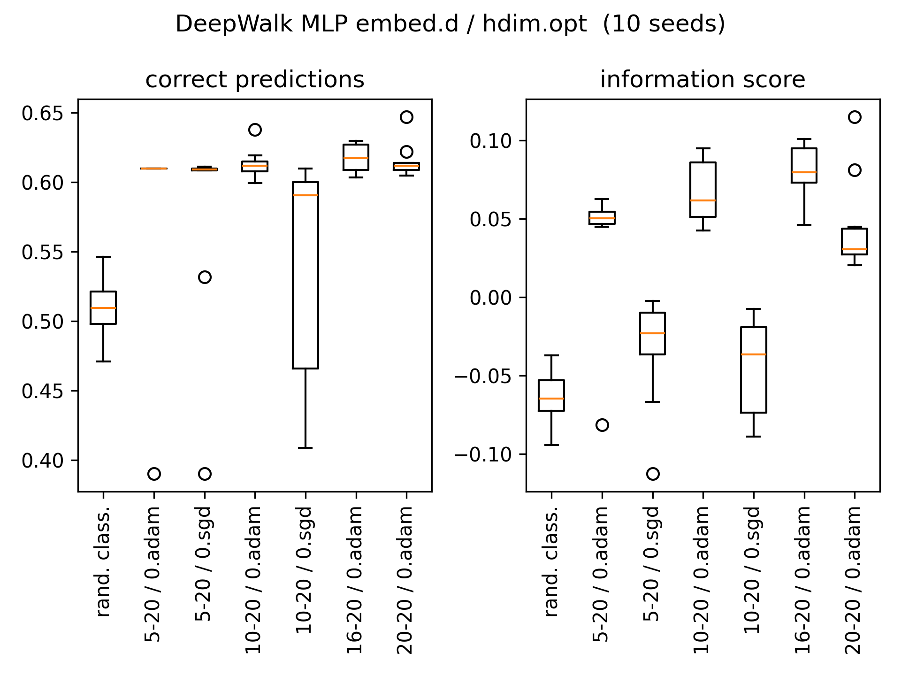

# How well do Simple Graph Convolution and GraphSAGE perform on Dihydrofolate reductase inhibition learning problem?

_Learning from networks_ course (INQ0091104) at DEI UniPD, academic year 2023-2024, personal contribution of student ID: 2019122

**Abstract.** TODO at the end With biological applications in mind, we consider the Dihydrofolate reductase datasets in order to study the performance of two graph-based, learning methods: Simple Graph Convolution and GraphSAGE.

## <a id='sec0'>-</a>Contents

[Introduction](#intro)

[1.](#sec1) Statistically significant features

[2.](#sec2) Random classifier

[3.](#sec3) Condensed node features + traditional MLP classifier

[4.](#sec4) Condensed DeepWalk embeddings + traditional MLP classifier

[5.](#sec5) Simple Graph Convolution

[6.](#sec6) GraphSAGE

[7.](#sec7) Classification performance results

[References](#refs)

[A.](#anx1) Future work 

## <a id="intro">-</a> Introduction (self-contained) [\^](#sec0)

Dihydrofolate reductase (DHFR) is an enzyme required for the survival of most cells as it is involved in the biosynthesis of essential cellular components: for this reason, it has attracted a lot of attention as a molecular target for various diseases. Researchers have reported different DHFR inhibitors in order to explore their therapeutic efficacy [[1]](#1).

A set of 756 inhibitors of DHFR was assembled: activities for a particular strain of  DHFR were reported as $\mathrm{IC_{50}}$ values for the inhibition of the enzymatic reduction that converts dihydrofolate to tetrahydrofolate. A certain value was selected as the threshold for activity [[2]](#2).

The original dataset DHFR is available at [chrsmrrs.github.io](https://chrsmrrs.github.io/datasets/docs/datasets/) [[3]](#3). The collection of networks is structured as follows:

* each inhibitor (molecule) is represented as a graph: nodes are associated to atoms, while edges represent chemical bonds;
* nodes are labeled with the name of the chemical element and 3 real-valued attributes represent the relative position of the atom (node) in the chemical compound (inhibitor);
* the inhibiting property of each graph (chemical compound) is given as a graph-level binary label (+1,-1);
* edges are given as tuples of nodes and have neither attributes nor labels.

| graph  | DHFR  | nodes              | DHFR                                | edges              | DHFR               |
| ------ | ----- | ------------------ | ----------------------------------- | ------------------ | ------------------ |
| count  | 756   | count              | 32075                               | count              | 33676 (undirected) |
| labels | {0,1} | avg / 1 graph      | 42                                  | avg / 1 graph      | 45                 |
|        |       | min, max / 1 graph | 20,71                               | min, max / 1 graph | 21, 73             |
|        |       | attributes         | atom rel. position $\in\mathbb R^3$ | attributes         | N/A                |
|        |       | labels             | atom ID $\in\mathbb N$              | labels             | N/A                |

The **DHFR learning task** consist in TODO explain the learning task

[Sec.1](#sec1) illustrates different tentatives in generating random collections of graphs starting from the observed data in DHFR with the final goal of assessing statistical significance of analytical node features. Resulting z-scores and p-values are analysed but look inconclusive, and therefore all available features are included as input data.

Sections [2](#sec2) to [6](#sec6) describe the different machine learning models used in tackling the DHFR learning problem. All models are developed in a dedicated python script and configured with a dedicated `.toml` file

+ the initial bias on the dataset is assessed with a [random classifier](#sec2). 
+ a baseline of the leaning potential of traditional machine learning tools is established by tuning a [one-hidden-layer perceptron](#sec3) on condensed node features for binary graph classification.
+ the potential of graph-based representations in machine learning is assessed by tuning a traditional perceptron on [embedded node features](#sec4) using DeepWalk method
+ a first fully-fledged graph convolution method called [Simple Graph Convolution](#sec5) is tuned on raw node features for binary graph classification
+ a second graph convolution method called [GraphSAGE](#sec6) is tuned on the same node features for graph classification.

Results are presented and discussed in [Sec.7](#sec7), where the classification performance of all five models is compared using two indexes: a standard score, and a more advanced information score [[8]](#8). While the former  simply counts the number of correct predictions, the latter compares the posterior class probability against the original dataset prior in order to assess the confidence of the model in predicting a class.

**Overall**, results suggests that TODO summary of conclusions

+ statistical significance

+ traditional MLP vs embedding MLP

+ graphSASGE against SImple graph convolution

All computations were performed offline on a *i7-9750H Intel CPU* laptop equipped with *Nvidia Quadro T1000 Mobile GPU* running an updated rolling release of EndeavourOS (6.7.0-arch3-1).
Most of the python scripts are configured entirely through `toml` files that can usually be stored on a separate location (to be fed as first positional argument on the python call). All models have been tuned multiple times with the same parameters but according to different random seed (see `computed/seedSequence_p10.txt`). 
Modules installed on the python virtual environment for this projectare listed (pip freeze) in file `DEPENDENCIES.txt`

# <a id="sec1">1.</a> Statistically significant features [\^](#secsec)

TODO why need to generate random graphs

As the structure of a graph represents a molecule, node degree and node labels should both be considered by any good random generator. Since each node corresponds to an atom (node label), the former represents the number of chemical bonds of the node with other atoms in the chemical compound. On the other hand, the number of possible chemical bonds is related to the chemical element identified by the the node label.

Mandatory sanity checks on the resulting random graph:

- should be undirected and have no self-loops
- should have no isolated nodes and count only one connected component with all the original nodes
- node degree distribution should resemble that of the original molecule

Other heuristic indicators:

- presence of elongated chains
- presence of tree like endings, usually associated to hydrogen bonding with other elements

## Random graph generation

Three random graph generators were developed in this work. Among these, only the last one was used to successfully generate 100 complete random collections (each counting 756 graphs).

**Chung-Lu sampling based on observed node labels adjacency**. Chung-Lu (CL) sampling method, samples random edges $(u,v)$ from a Bernoulli random variable having probability $\propto \deg(u) \deg(v)$. This idea was modified to take into account the observed distribution of adjacent node labels for each graph. Given a graph (molecule) of the DHFR collection, a distribution directly connected labels can be computed by simply counting relative frequencies of the observed edges in the graph. Then, this new probability matrix (referred to as *node label adjacency probability*) can be used to sample edges, possibly in combination with the CL probability matrix.

Script `randomGraph_CL.py` implements this idea, but the generated graphs were not satisfying from a physical point of view. In particular, generated graphs suffered from larger number of edges with respect to each original graph, and in general, it was not clear how to combine the two types of probability matrices.

**Random Walk generator driven node label adjacency**.  Visual inspection of molecules taken form the DHFR collection seem to confirm by the presence of one or two elongated chains possibly folded in one or two intermediate loops with arbitrary length. This inspired the creation of an edge-sampling algorithm based on random walks where the walks were driven by Bernoulli random variables using the observed node label adjacency probabilities (relative frequencies, as described above).

Script `randomGraph_RW.py` implements this idea, but the generated graphs were not satisfying from a physical point of view. Hyper-parameters *walk_length* and *num_walks* proved hard to tune and resulted in poor random samples with many isolated nodes.

**Soft edge swapping controlled by CL probabilities and node label adjacency**. In order to ensure a correct degree distribution of the generate random graphs, a modified swapping algorithm was developed. Candidate edges where sampled by choosing two nodes with CL probabilities, this promoted swaps on nodes (atoms of the molecule) having higher degree (chemical connections). Then, compliant candidates were accepted as successful swap only when a Bernoulli random variable based on *node label adjacency probability* resulted positive. This allowed to model both the distribution of node connections and the bias between node labels.

Script `randomGraph_softSwap.py` implements the following algorithm for each `graph` in the DHFR collection in function `randomGraph(graph:Data)` in lines 42-146:

```{pseudocode}
Pr_NL = node label adjacecy probability # lines 48-55
Pr_CL = Chung-Lu degree probability # lines 58-69

WHILE swap_done < swap_todo DO:
    (u,v), (z,w) = two edge samples from Bernoulli(Pr_CL) # lines 80-87

    diff_ok : ensure different edges have been sampled
    uw_ok : ensure edge (u,w) is not already present
    zv_ok : ensure edge (z,v) is not already present
    degs_ok : ensure the resulting swap does not generate isolated nodes
    IF (u,v) AND (z,w) compliant THEN:

        uw_sample = Bernoulli(Pr_NL[u,w])
        zv_sample = Bernoulli(Pr_NL[z,v])
        IF uw_sample AND zv_sample THEN:

           graph_new = SWAPEDGES(graph,(u,v),(z,w)) # lines 109-118
           # id:  j j     i i      =>       j j     i i
           # [... u z ... v w ...      [... u z ...(w v)... 
           #  ... v w ... u z ...]      ...(w v)... u z ...]

RETURN graph_new   
```

## Computed analytics

The following node features were implemented as custom PyG dataset tranforms by resorting to other external libraries

| feature                | base class (PyG) | dependency | function call                                                                                                                                                                                                       | notes                                                                                                                                                                                                                                                     |
| ---------------------- | ---------------- | ---------- | ------------------------------------------------------------------------------------------------------------------------------------------------------------------------------------------------------------------- | --------------------------------------------------------------------------------------------------------------------------------------------------------------------------------------------------------------------------------------------------------- |
| node degree            | `BaseTranform`   | Torch      | `sparse_coo_tensor` : sum adjacency matrix on dim=1                                                                                                                                                                 | differs from NetworkX [degree_centrality](https://networkx.org/documentation/stable/reference/algorithms/generated/networkx.algorithms.centrality.degree_centrality.html#networkx.algorithms.centrality.degree_centrality) only by a normalisation factor |
| closeness centrality   | `BaseTranform`   | NetworkX   | [closeness_centrality](https://networkx.org/documentation/stable/reference/algorithms/generated/networkx.algorithms.centrality.closeness_centrality.html#networkx.algorithms.centrality.closeness_centrality)       |                                                                                                                                                                                                                                                           |
| betweenness centrality | `BaseTranform`   | NetworkX   | [betweenness_centrality](https://networkx.org/documentation/stable/reference/algorithms/generated/networkx.algorithms.centrality.betweenness_centrality.html#networkx.algorithms.centrality.betweenness_centrality) |                                                                                                                                                                                                                                                           |
| node clustering        | `BaseTranform`   | NetworkX   | [clustering](https://networkx.org/documentation/stable/reference/algorithms/generated/networkx.algorithms.cluster.clustering.html#networkx.algorithms.cluster.clustering)                                           |                                                                                                                                                                                                                                                           |
| loop (motif) count     |                  | Graph-tool | [clustering.motifs](https://graph-tool.skewed.de/static/doc/autosummary/graph_tool.clustering.motifs.html)                                                                                                          | see [A](#anx1)                                                                                                                                                                                                                                            |

The node clustering coefficient is identically 0 for all molecules. Inspections from pictorial representations of the molecules seem to confirm this result, as no triangle can be seen.


Graphlet count is not straight forward, and it is not readily implemented nor in NetworkX nor in PyG. Inspection of pictorial representations of samples from the dataset suggests to take into account loops having variable length. 


Script `statisticalSignificance.py` is configured by `statisticalSignificance.toml` and computes violin plots of p-values and z-scores approximated distribution for the computed analytical features. P-values have been computed for both probabilities greater and smaller than the value observed in the true DHFR graph, for all nodes in all graphs. In particular, the score is first computed for each node among all possible variations (of the same node) in the available random collections, and then the value is plotted for all nodes in all graphs of the collection. 

The plot suggest that features betweenness centrality and closeness centrality are mildly statistically significant. On the one hand, node degree could not be assessed because the chosen random generator identically preserves the degree distribution of the original dataset. On the other hand, node clustering was reported as null for all DHFR dataset and therefore there is little information in knowing that possible random variations have a different value.            
            
     

## Data pre-processing

Once the statistical significance of candidate analytical features has been, a new dataset can be generated by adding computed features to the original external features. This results in the a total of 7 feature columns

| position      | node label  | degree      | closeness | betweenness |
| ------------- | ----------- | ----------- | --------- | ----------- |
| $\mathbb R^3$ | $\mathbb N$ | $\mathbb N$ | $[0,1]$   | $[0,1]$     |

Script `featurePreparation.py` exported the final dataset to be used as input information for machine learning operations in folder `computed/` with name **20240115-105053**

+ the datatset is available as PyG dataset in the subfolder with the same name

+ condensed dataset where, for each graph, node features have been condensed by stacking *feature mean* and* feature variance*, is available in files **20240115-105053_input.pt** (graph classification input) and **20240115-105053_output.pt** (true classes)

# <a id="sec2">2.</a> Random classifier [\^](#sec0)

The script `randomClassifier.py` uses the configuration file `randomClassifier.toml` and generates 5 datasets:

1. the output of a random prediction based on a uniform posterior distribution over the two available classes
2. a synthetic _always correct_ dataset of predictions used to debug the implementation of the information score used in [Sec. 7](#sec7). These predictions are always correct with a posterior probability of 1 in the correct class
3. a synthetic _always incorrect_ dataset of predictions used for the same purpose. Predictions are always wrong with posterior probability equal to 1
4. a synthetic _always useful_ dataset of predictions used for the same purpose. These predictions are always correct but a slightly higher posterior probability on the correct class with respect to the 
5. a synthetic _always misleading_ dataset of predictions used for the same purpose. Predictions  are always correct with a posterior probability of the correct class being smaller than the prior distribution of the input dataset 

This model has no hyper-parameters and therefore does not require tuning. The variability of the output is controlled by the random seed.

# <a id="sec3">3.</a> Condensed features + traditional MLP classifier [\^](#sec0)

Multi-Layer Perceptron (MLP) is a very popular machine learning model. Here we consider a simplified MLP architecture having only one hidden layer, ReLU activation functions, and dropout regularisation. The input data for this model architecture is condensed node features mean and variance described above.

Torch classes [Linear](https://pytorch.org/docs/stable/generated/torch.nn.Linear.html), [ReLU](https://pytorch.org/docs/stable/generated/torch.nn.ReLU.html#relu), [Softmax](https://pytorch.org/docs/stable/generated/torch.nn.Softmax.html#softmax)  are used in a 2-layer-nn model in script `traditionalMLP.py` which is configured by `traditionalMLP.toml` where the hyper-parameters of the model are exposed :

| layer 1                    | layer 2                             | optimiser                                       |
| -------------------------- | ----------------------------------- | ----------------------------------------------- |
| dropout                    | hidden_dim: 0 (layer 2 deactivated) | Adam: learning rate, weight decay               |
| activation (default: true) | dropout                             | SGD: learning rate, weight decay, momentum, ... |
|                            | activation (default: true)          |                                                 |

## Tuning procedure and model selection

First decide which optimiser works best, then find the optimal dimension of the hidden layer


The figure above shows that *Adam* optimiser outperforms *SGD* in all circumstances. The *Adam* optimiser is therefore retained and used to find the optimal hidden layer dimension


MPL with hidden dimension 4000 is therefore chosen as best performance indicator of a traditional MLP and compared against other models in [Sec.7](#sec7), training `.log` and output `.pt` predictions are stored as **240122-125741** in `computed/traditionalMLP/`.

# <a id="sec4">4.</a> Condensed DeepWalk embedding + traditional MLP classifier  [\^](#sec0)

Graph embedding is a technique that allows to represent the information stored in a graph on a standard $\mathbb R^d$ abstract space that allows to make use of traditional ML models. DeepWalk [[7]](#7) is one such techniques that allow to compute embedding representations of graph structures by solving an optimisation problem.

Once the node embedding have been computed, the new representation needs to be condensed in order to represent every single node. Here, it is chosen to use the same condensation function used for traditional MLP in [Sec.3](#sec3), namely to stack one after the other: the *node embedding mean* and the *node embedding variance*.

PyG implementation class [node2vec](https://pytorch-geometric.readthedocs.io/en/latest/generated/torch_geometric.nn.models.Node2Vec.html) is used in a 2-step script `embeddingMLP.py`: it performs both the embedding optimisation and the MLP training in two nested loops. PyG allows to compute DeepWalk embedding by resorting to the node2vec module with settings $p=q=1$. The script is configured by `embeddingMLP.toml` where the hyper-parameters of the model are exposed :

| node2vec               | layer 1                    | layer 2                             | optimiser                                       |
| ---------------------- | -------------------------- | ----------------------------------- | ----------------------------------------------- |
| embedding_dim          | dropout                    | hidden_dim: 0 (layer 2 deactivated) | Adam: learning rate, weight decay               |
| walk_length\*          | activation (default: true) | dropout                             | SGD: learning rate, weight decay, momentum, ... |
| context_size\*         |                            | activation (default: true)          |                                                 |
| walks_per_node\*       |                            |                                     |                                                 |
| num_negative_samples\* |                            |                                     |                                                 |
| \* set arbitrarily     |                            |                                     |                                                 |

**Warning.** Modify PyG `node2vec.py` lines 120 and 134 and change `dim=0` to `dim=1` in the `torch.cat` call of the `return` on functions `pos_sample` and `neg_sample`. At time of writing it is not clear if this is a bug in PyG implementation, an issue has been open on the developers repository TODO issue number

## Tuning procedure and model selection

First the optimiser and the embedding dimensions are studies, then the optimal MLP hidden layer dimension is selected by using the best optimiser. All other parameters are set by naive intuition and should require more study.



TODO explain first figure, introduce second


TODO Model XXX is therefore retained as best performance indicator of the architecture DeepWalk + MLP and compared against other models in [Sec.7](#sec7), training log and output predictions are stored as **XXXX** in `computed/embedingMLP/`.

# <a id="sec5">5.</a> Simple Graph Convolution [\^](#sec0)

The Simple Graph Convolution (SGC) model was introduced in [[5]](#5) and tries to simplify the parametric complexity if standard graph convolution networks by getting rid of intermediate activation functions and condensing the resulting parameters. 

PyG implementation class [SGConv](https://pytorch-geometric.readthedocs.io/en/latest/generated/torch_geometric.nn.conv.SGConv.html#torch_geometric.nn.conv.SGConv)  is used in a 2 layer convolution model in script `graphNN_SGC.py`. The script is configured by `graphNN_SGC.toml` where the hyper-parameters of the model are exposed :

| hidden dim.    | aggregation | depth ($K$) |
| -------------- | ----------- | ----------- |
| 0 (1 layer)    | mean        | 1           |
| > 1 (2 layers) | max         | 2           |
|                | min         | 2           |
|                | mul         |             |

## Tuning procedure and model selection

The depth and aggregation hyper-parameters are analysed first by tuning a single SGC layer. Data suggests that depth values above 1 are not helpful in the learning task. It can be seen how mean and max aggregation functions perform better against the other possibilities


The effectiveness of the hidden layer is studied by training 2 SGC layers of depth 1 or 2 and aggregation function mean or max. Data suggest the max aggregation function (in message passing) peforms best with a hidden layer dimension of 10.


This SGC is therefore chosen as best performance indicator of SGC and compared against other models in [Sec.7](#sec7), training `.log` and output `.pt` predictions are stored as **XXXX** in `computed/SimpleGC/`.

# <a id="sec6">6.</a> GraphSAGE [\^](#sec0)

TODO filler paragraph [[6]](#6)

PyG implementation class [SAGEConv](https://pytorch-geometric.readthedocs.io/en/latest/generated/torch_geometric.nn.conv.SAGEConv.html#torch_geometric.nn.conv.SAGEConv)  is used in a 2 layer convolutional model in script `graphNN_GraphSAGE.py`. The script is configured by `graphNN_GraphSAGE.toml` where the hyper-parameters of the model are exposed :

| hidden dim.    | aggregator | optimizer |
| -------------- | ---------- | --------- |
| 0 (1 layer)    | mean       | Adam      |
| > 1 (2 layers) | max        | SGD       |
|                | min        |           |
|                | mul        |           |

## Tuning procedure and model selection

First, different aggregation functions are addressed with a single convolution layer. Then, the best aggregation functions are tuned with the optimal hidden layer dimension.


The figure above does not suggest any aggregation function, and based on the gathered experience, only max and mean functions are tuned to the optimal hidden layer dimension.


GraphSAGE with max agregation and a hidden layer of 400 units is therefore chosen as best performance indicator of SGC and compared against other models in [Sec.7](#sec7), training log and output predictions are stored as **XXXX** in `computed/GraphSAGE/`.

# <a id="sec7">7.</a> Classification performance results [\^ ](#sec0)

The script  `classificationPerformance.py` is configured by a `.toml` file that is fed to the python call as first argument. The same script has been used to plot all of the score comparisons in this work and different `.toml` files are available in the root folder for each model.

## Information score

[[8]](#8) proposes an information score computed as follows

$$I_r = I_a/E \quad I_a = \frac 1 T \sum_j I(j) \quad I:{\set{1,\dots, k}\atop C}{\to \atop\mapsto}{\R \cap (-\infty, 1]\atop \begin{cases} V_c(C) & P'(C)\geq P(C) \\ V_m(C) & \text{otw} \end{cases}}$$

where:

+ $P(\bullet)$ and $P'(\bullet)$ denote the prior and posterior (the classifier) probabilities for a given class. Usually the prior is estimated from the relative frequencies computed using the training set
+ the value for a useful prediction of class $C$ is $V_c(C)=-\log_2P(C)+ \log_2P'(C)$
+ the value for a misleading prediction is $V_m(C) = -\log_2[1-P(C)]+ \log_2[1-P'(C)]$
+ $T$ is the number of predictions
+ the entropy $E = \sum_i P(i) \log_2P(i)$ for all classes $i$, is assumed to be the same for training and test sets.


This score allows to assess the confidence of the model prediction with respect to the correct answer. The model prediction is chosen using $\arg\max$ of the posterior probabilities but the probability with which the model chooses the right answer might be smaller than that of the prior distribution. In such case the  score penalises the answer. The score is null when the model chooses always the right class by replicating the prior distribution.  Score 1 is obtained only when the gives all correct answers with posterior 1 (categorical); whereas a score less than -1 is obtained when all predictions are wrong with probability one.~~~~

## Final results

Final comparison of all best models is shown below. Tuned hyper-parameters for all model are available in the corresponding `.log` file in the `computed/` sub-folder:

+ trad. MLP `traditionalMLP/`**240122-125741**

+ embed. MLP  `embeddingMLP/`**240122-151913**

+ Simple GC `SimpleGC/`**240121-234629**

+ GraphSAGE `GraphSAGE/`**240122-001632**


The overall study suggests the following conclusions:

+ traditional

+ embedding MLP very hard to train because of the huge amount of hyper-parameters. Higher embedding optimization scores tends to make the model suffer form overfitting. 

+ simple graph convolution looks promising but fails to generalize with sufficient confidence. Different aggregation function should be studied

+ GraphSAGE outperforms all model 

TODO remember to update the claimed results in the intro

# <a id="refs">-</a> References [\^](#sec0)

<a id="1">[1]</a> S. R et al., “DihydrofolateReductase (DHFR) Inhibitors: A Comprehensive Review,” Current medicinal chemistry, Mar. 2023, doi: [10.2174/0929867330666230310091510](https://doi.org/10.2174/0929867330666230310091510).

<a id="2">[2]</a> J. J. Sutherland, L. A. O’Brien, and D. F. Weaver, “Spline-fitting with a genetic algorithm: A method for developing classification structure-activity relationships,” J Chem Inf Comput Sci,
vol. 43, no. 6, pp. 1906–1915, 2003, doi: [10.1021/ci034143r](https://doi.org/10.1021/ci034143r).

<a id="3">[3]</a> C. Morris, N. M. Kriege, F. Bause, K. Kersting, P. Mutzel, and M. Neumann, “TUDataset: A collection of benchmark datasets for learning with graphs.” Accessed: Nov. 04, 2023. [ArXiv](http://arxiv.org/abs/2007.08663)

<a id="4">[4]</a> R. A. Rossi and N. K. Ahmed, “The Network Data Repository with Interactive Graph Analytics and Visualization,” in AAAI, 2015. [networkrepository.com](https://networkrepository.com).

<a id="5">[5]</a> F. Wu, A. Souza, T. Zhang, C. Fifty, T. Yu, and K. Weinberger, “Simplifying Graph Convolutional Networks,” in Proceedings of the 36th International Conference on Machine Learning, PMLR, May 2019, pp. 6861–6871. Accessed: Oct. 21, 2023. [Online](https://proceedings.mlr.press/v97/wu19e.html)

<a id="6">[6]</a> W. L. Hamilton, R. Ying, and J. Leskovec, “Inductive Representation Learning on Large Graphs.” Accessed: Nov. 08, 2023. [ArXiv](http://arxiv.org/abs/1706.02216)

<a id="7">[7]</a> B. Perozzi, R. Al-Rfou, and S. Skiena, “Deep Walk: Online learning of social representations,” in Proceedings of the 20th ACM SIGKDD international conference on Knowledge discovery and data mining, in KDD ’14. New York, NY, USA: Association for Computing Machinery, Aug. 2014, pp. 701–710. doi: [10.1145/2623330.2623732](https://doi.org/10.1145/2623330.2623732).

<a id="8">[8]</a>  I. Kononenko and I. Bratko, Information-based evaluation criterion for classifier' s performance, Mach Learn, vol. 6, no. 1, pp. 67, 80, Jan. 1991, doi: [10.1007/BF00153760](https://doi.org/10.1007/BF00153760)

# <a id="anx1">A.</a> Future work [\^](#sec0)

- [ ] A modified dataset DHFR-MD is available at [networkrepository.com](https://networkrepository.com/DHFR-MD.php) [[4]](#4) but has not been considered in the current stage of this work because TODO

- [ ] [Sec.1](#1) **Advanced rangom generator.** The [DIG: Dive into Graphs](https://diveintographs.readthedocs.io/en/latest/) framework provides the implementation of several advanced algorithms for [graph generation](https://diveintographs.readthedocs.io/en/latest/tutorials/graphdf.html) :
  
  + JT-VAE , **GraphAF** , GraphDF , GraphEBM 
  
  + the problem with these implementations is that they need to be re-trained from the beginning on the DHFR dataset

- [ ] [Sec.1](#1) Compute more node features by counting loops of arbitrary length in each molecule. Make use []of graph-tool library

- [ ] [Sec.5](#5)Explore other aggregation functions for the message passing of each convolution layer and more global node aggregation layers for representing the graph before the prediction
  
  + general introduction on [aggregation operators](https://pytorch-geometric.readthedocs.io/en/latest/modules/nn.html?highlight=readout#aggregation-operators) from PyG official documentation
  
  + other global node aggregators for the readout layer: [pooling layers](https://pytorch-geometric.readthedocs.io/en/latest/modules/nn.html#pooling-layers)

- [ ] [All sections](#0) Consider more random seed on the tuned models in order to better approximate the noise of the random shuffling

- [ ] [Sec.7](#7) improve the classification performance plots by displaying the score of training and validation for each seed. This is complicated because for each seed you need to append the information in the log file generated together with the posterior probabilities or the log file
  
  + for eg. split  (replace) the box plot (with a seaborn violin plot) and plot the training score on one side, and the validation score on the other
  
  + the same could be done for the for the information score but is more involved because the prior probabilities might differ between the training set and the validation set
  
  + more random seeds were prepared in `computed/seedsSequanece_pn20` but never used due to time constraints
